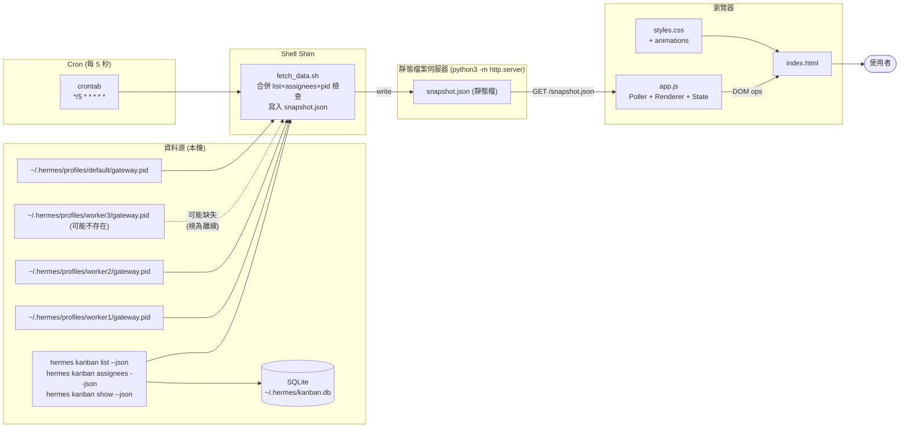
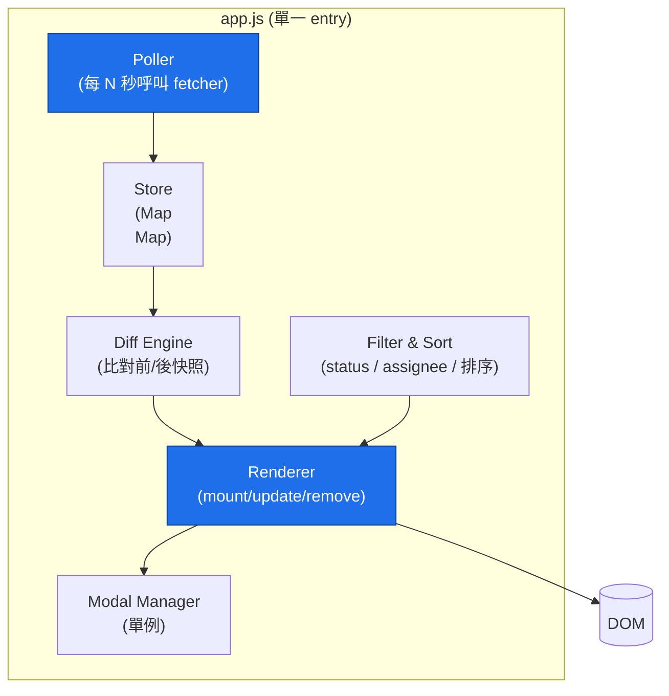
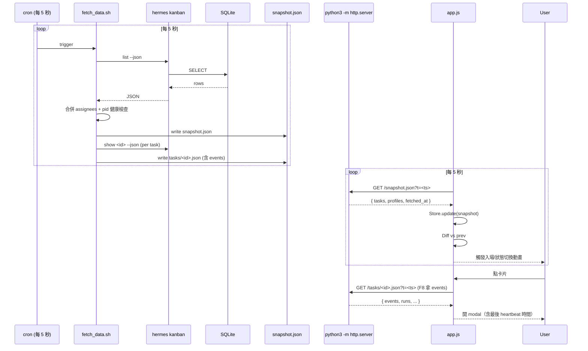
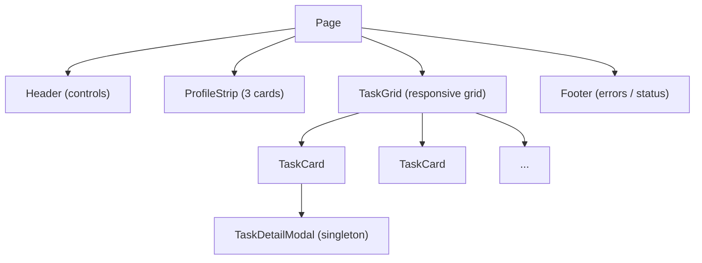

# Kanban Dashboard 架構規劃

> **For Hermes:** 接續 `research-plan.md` 的功能需求，本文件定義具體的元件、資料流、技術選擇與動畫規格。實作時請照 `tasks.md` 的順序執行。

---

## 1. 系統總覽 (System Overview)

整個系統由三個獨立的「資料源」餵給瀏覽器，瀏覽器內的 SPA 把資料整理、繪製、播放動畫。



**關鍵設計**：瀏覽器**只看靜態 `snapshot.json`**，絕不直接呼叫 `hermes` CLI 或讀 `gateway.pid`（瀏覽器沒有本機 fs、也不該被 CORS 綁架）。`fetch_data.sh` 由 cron 每 5 秒執行一次，把 list+assignees+pid 健康檢查合併寫到 `snapshot.json`；同時逐個 task 寫 `tasks/<id>.json`（含 events，給 modal 顯示 heartbeat）；`python3 -m http.server` 把整個目錄當靜態檔案伺服。Frontend 只看到一條乾淨的資料流。

---

## 2. 元件分解 (Component Decomposition)



### 2.1 模組職責

| 模組 | 輸入 | 輸出 | 失敗行為 |
|---|---|---|---|
| `Poller` | `interval` (ms) | emit `data` event | CLI 失敗 → emit `error`，UI 顯示 banner，繼續輪詢 |
| `Store` | new snapshot | diff events (`added`/`removed`/`changed`) | 以 task.id 為 key，去重 |
| `Diff Engine` | prev + next state | 事件流 | status 改變觸發 transition class |
| `Renderer` | diff events + filter | DOM 操作 | 找不到元素時重新 mount |
| `Filter & Sort` | user input | 過濾後的清單 | local state；不動 store |
| `Modal Manager` | task id | 顯示 / 隱藏 | 同時只能開一個 |

### 2.2 為什麼用 Diff 而非全幅重繪

每 5 秒重繪 50 張卡片 = 動畫永遠跑不完，使用者也會看到畫面閃爍。Diff 引擎確保只有真正變動的元素播放動畫。

---

## 3. 資料流 (Data Flow)



---

## 4. 動畫系統 (Animation System)

### 4.1 動畫分類

| 類型 | 觸發時機 | 規格 | CSS class |
|---|---|---|---|
| Entrance | 新卡片加入 | fade-in + translateY(12px → 0)，350ms ease-out | `.card--enter` |
| Status change | 同一張卡 status 變了 | 徽章 bg-color 過渡 300ms + scale(1 → 1.05 → 1) pulse | `.badge--pulse` |
| Remove | 任務被 archive / 刪除 | fade-out + scale(1 → 0.95) 250ms | `.card--exit` |
| Modal open | 開啟 | overlay fade 200ms；內容 scale(0.95 → 1) 200ms ease-out | `.modal--open` |
| Skeleton | 初次載入（資料未到） | 灰塊 shimmer 動畫 | `.skeleton` |
| Profile pulse | profile 剛從離線變線上 | hero card glow 1.2s 一次 | `.profile--just-up` |

### 4.2 動畫設計原則

- **入場用 translateY 而非 scale**：避免 layout shift。
- **狀態切換只動徽章，不動整張卡片**：保留閱讀穩定性。
- **尊重 `prefers-reduced-motion`**: 偵測到時把動畫時長縮短到 0.01ms。
- **避免連續動畫**（cooldown 200ms）：同一張卡在 200ms 內多次變化只播一次。

### 4.3 CSS Variables 統一控制

```css
:root {
  --ease-out: cubic-bezier(0.16, 1, 0.3, 1);
  --dur-enter: 350ms;
  --dur-status: 300ms;
  --dur-exit: 250ms;
}
@media (prefers-reduced-motion: reduce) {
  :root { --dur-enter: 0.01ms; --dur-status: 0.01ms; --dur-exit: 0.01ms; }
}
```

---

## 5. 狀態管理 (State Shape)

```javascript
// app.js 內部狀態（in-memory only，不持久化）
const store = {
  tasks: new Map(),   // id -> Task
  profiles: new Map(),// name -> { name, on_disk, counts, online, pid, last_seen }
  meta: {             // 給 UI 用的計算屬性
    lastFetch: Date,
    isPaused: bool,
    lastError: string|null,
    filter: { status: 'all', assignee: 'all', sort: 'created_desc' }
  }
};
```

每個 Task 物件從 CLI 加上兩個本地衍生欄位：
- `_statusChangedAt`: 上次狀態變動時間（給動畫 cooldown 用）
- `_localEntered`: 卡片是否正在播入場動畫

---

## 6. 介面佈局 (Layout)

```
┌──────────────────────────────────────────────────────────────┐
│  HEADER                                                      │
│  ┌──────────────────────────────────────────────────────┐    │
│  │  Hermes Kanban Dashboard    [⏸ Pause]  [⟳ Refresh]   │    │
│  │  Last update: 12:34:56    Filter: [All▾] [All▾]      │    │
│  └──────────────────────────────────────────────────────┘    │
│                                                              │
│  PROFILE STRIP                                               │
│  ┌──────────┐  ┌──────────┐  ┌──────────┐                    │
│  │ ●worker1 │  │ ●worker2 │  │ ○default │                    │
│  │ online   │  │ online   │  │ offline  │                    │
│  │ run: 2   │  │ run: 0   │  │ run: 0   │                    │
│  └──────────┘  └──────────┘  └──────────┘                    │
│                                                              │
│  TASK GRID (auto-fill, minmax(320px, 1fr))                   │
│  ┌─────────────┐  ┌─────────────┐  ┌─────────────┐           │
│  │ t_abc123    │  │ t_def456    │  │ t_ghi789    │           │
│  │ [running]   │  │ [blocked]   │  │ [done]      │           │
│  │ PopChill…   │  │ Kanban…     │  │ Refactor…   │           │
│  │ worker1     │  │ worker2     │  │ default     │           │
│  │ 12m ago     │  │ 2h ago      │  │ yesterday   │           │
│  └─────────────┘  └─────────────┘  └─────────────┘           │
│                                                              │
│  FOOTER (error banner / status hint)                         │
└──────────────────────────────────────────────────────────────┘
```



### 6.1 響應式

- `>1200px` TaskGrid 4 欄
- `900-1200px` 3 欄
- `600-900px` 2 欄
- `<600px` 1 欄 + ProfileStrip 改直式堆疊

---

## 7. 部署模式：cron + 靜態伺服器

經審查，**只支援一種模式**。原本考慮過兩個替代方案但都否決：
- **`file://` 直接打開**：瀏覽器對 `file://` 協議下的 `fetch()` 設了 CORS 鎖，連讀同目錄的 JSON 都會被擋（見 §7.2）。
- **WebSocket streaming**（未來 hermes-gateway 內建 HTTP endpoint）：本期不在範圍（見 §7.4）。

### 7.1 啟動步驟

```bash
# 1. 啟動靜態檔案伺服器（前台或 background 都行）
python3 -m http.server 8000 --directory /tmp/kanban-dashboard

# 2. 另一個 terminal 註冊 cron：每 5 秒跑一次 fetch_data.sh
(crontab -l 2>/dev/null; echo "*/5 * * * * * /tmp/kanban-dashboard/fetch_data.sh > /tmp/kanban-dashboard/snapshot.json 2>/tmp/kanban-dashboard/snapshot.err") | crontab -

# 3. 瀏覽器開 http://localhost:8000
```

> **注意**：`*/5 * * * * *` 是 Quartz 風格（5 個欄位 + 秒），需要 `vixie-cron` 或 `cronie`；若系統只有傳統 `cron`（5 欄位、無秒），改寫成 wrapper 迴圈：
> ```bash
> while true; do /tmp/kanban-dashboard/fetch_data.sh > /tmp/kanban-dashboard/snapshot.json; sleep 5; done
> ```

### 7.2 為什麼不用 file://

瀏覽器對 `file://` 協議下的 `fetch()` 設了 CORS 鎖，連讀同目錄的 JSON 都會被擋。前端若要直接讀本地檔，唯一解法是 LocalShim（XHR+file://），但仍然不能跑 `hermes` CLI，等於把資料流切兩半。所以：**統一走 http server**，避免雙軌制帶來的除錯混亂。

### 7.3 為什麼前端不直接呼叫 CLI

- **CORS 鎖** — 瀏覽器不能 spawn 行程。
- **每 5 秒 spawn 一次 `hermes runtime` 開銷高** — 載入整個 Python venv + Hermes framework，每次約 200-500ms CPU 時間、~80MB 記憶體抖動。
- **多瀏覽器 tab 同時開 → 重複 CLI 呼叫** — N 個 tab 就是 N 倍負擔。
- **解法**：把 CLI 呼叫集中到**一個** cron job，輸出寫到靜態檔；前端 N 個 tab 都只讀同一份檔，零額外開銷。

### 7.4 模式 C（進階，留 hook，不實作）

未來若 `hermes-gateway` 加 HTTP endpoint（`--web` 旗標），可把 `app.js` 的 `fetchSnapshot()` 換成 `fetch('http://localhost:port/api/kanban/snapshot')`，**前端零改動**。`fetch_data.sh` + cron 可以退役。

---

## 8. fetch_data.sh 規格

`fetch_data.sh` 讀 hermes CLI + 各 profile 的 pid 檔，合併成單一 JSON 寫到 `snapshot.json`。**由 cron 觸發**（見 §7.1），不在前端 hot path 上。

### 8.1 Profile 健康檢查 — 健壯的 online 判定

**問題**：審查時發現 `worker3` 這個 profile **可能根本沒有 `gateway.pid` 檔**（profile 尚未啟動、或被手動清理）。舊腳本直接 `if [ -f PID_FILE ]` 漏過這情況，會把不存在的 profile 標成 `online=false` 但 emit 的 JSON 仍包含 `pid: null` 欄位，導致前端 `null.online` throw。

**修法**：三段式 fallback，並把「pid 檔缺失」視為**正常離線狀態**而非錯誤：

```bash
#!/usr/bin/env bash
# 合併 list + assignees + pid 健康檢查，輸出單一 JSON 到 stdout。
# 由 cron 觸發；輸出由 python3 -m http.server 當靜態檔案服務。
set -uo pipefail   # 注意：不用 -e，因為 hermes CLI 偶爾回非零仍要繼續

OUT_PATH="${1:-/tmp/kanban-dashboard/snapshot.json}"
OUT_DIR="$(dirname "$OUT_PATH")"
LIST=$(hermes kanban list --json 2>/dev/null || echo '[]')
ASSIGNEES=$(hermes kanban assignees --json 2>/dev/null || echo '[]')

# 對每個 known profile 做線上檢查；三段式 fallback：
#   1. pid 檔存在 → 讀取 pid → kill -0 確認行程活著
#   2. pid 檔不存在 → 視為離線（不報錯，是合法狀態）
#   3. pid 檔存在但 pid 已死 → 視為離線 + 記 warning 到 stderr
build_profiles() {
  python3 - <<'PY'
import json, os, subprocess, sys, time
try:
    assignees = json.loads('''$ASSIGNEES''')
except Exception:
    assignees = []
try:
    tasks = json.loads('''$LIST''')
except Exception:
    tasks = []

known = sorted({a['name'] for a in assignees} | {t.get('assignee') for t in tasks if t.get('assignee')})

out = []
for name in known:
    pid_file = os.path.expanduser(f"~/.hermes/profiles/{name}/gateway.pid")
    online = False
    pid = None
    last_seen = None
    reason = "ok"
    if os.path.isfile(pid_file):
        try:
            with open(pid_file) as f:
                meta = json.load(f)
            pid = meta.get("pid")
            last_seen = meta.get("start_time")
            if pid and subprocess.run(["kill", "-0", str(pid)],
                                      capture_output=True).returncode == 0:
                online = True
            else:
                reason = "pid_dead"
        except (OSError, ValueError) as e:
            reason = f"pid_unreadable:{e}"
    else:
        reason = "no_pid_file"  # 合法離線狀態，不報錯
    entry = {"name": name, "online": online, "pid": pid,
             "last_seen": last_seen, "reason": reason}
    # counts 從 assignees 拿
    counts = next((a.get("counts", {}) for a in assignees if a.get("name") == name), {})
    entry["counts"] = counts
    out.append(entry)

print(json.dumps({
    "fetched_at": int(time.time()),
    "tasks": tasks,
    "profiles": out,
}, ensure_ascii=False))
PY
}

build_profiles > "$OUT_PATH"

# 順便把每個 task 的完整詳情（包含 events）寫到 tasks/<id>.json，
# 給 modal 開啟時查 heartbeat 用（list snapshot 不含 events，見 §1.1）。
mkdir -p "$OUT_DIR/tasks"
for tid in $(python3 -c "import json; d=json.load(open('$OUT_PATH')); [print(t['id']) for t in d.get('tasks',[])]"); do
  hermes kanban show "$tid" --json 2>/dev/null > "$OUT_DIR/tasks/$tid.json" || true
done
```

### 8.2 關鍵設計決策

- **不要在 shell 內拼 JSON**：用 `python3 <<'PY' ... PY` heredoc 一次完成 JSON 構造，避免 shell quoting escape 把 JSON 弄壞。
- **不要 `set -e`**：hermes CLI 偶爾回非零（race condition）仍要把當下可取得的資料寫出去，partial snapshot 比 no snapshot 好。
- **原子寫入**：上例省略了 `mv` 暫存檔，理想是 `tmp.$$ + mv`，避免前端讀到半寫的檔。Task 1 實作時補上。
- **不刪 pid 檔**：就算 `kill -0` 失敗也不主動清，讓營運者能事後 forensics。

---

## 9. 錯誤處理 (Error Handling)

| 失敗點 | 行為 |
|---|---|
| `hermes kanban` CLI 不在 PATH | Banner：「hermes CLI 找不到。請確認 `$HOME/.hermes/hermes-agent/venv/bin` 在 PATH」 |
| CLI 回傳非 JSON | Banner + 把 raw 輸出塞到 hidden `<pre>` 方便 debug |
| `pid` 檔**不存在**（profile 從未啟動或被手動清理，例如 `worker3` 預設缺檔） | 該 profile `online=false`、`reason="no_pid_file"`、**視為合法離線狀態、不 log warning**（避免無訊號的「warning 風暴」） |
| `pid` 檔存在但讀取失敗（權限 / JSON 壞掉） | `online=false`、`reason="pid_unreadable:<err>"`、stderr log 一次 |
| `pid` 檔存在但行程已死（`kill -0` 失敗） | `online=false`、`reason="pid_dead"`、stderr log warning（pid 檔**不主動刪除**，留供事後 forensics） |
| 連續 3 次輪詢失敗 | 把 polling interval 自動調到 30s，並顯示「degraded mode」；下次成功後自動恢復 5s |
| Modal 開啟時網路失敗 | Modal 內顯示 inline error，按鈕 retry |

> **三段式 fallback 對照**：見 §8.1 的 `build_profiles()`，每個 profile 的 online 判定都跑 (1) pid 檔存在 → kill -0 確認、(2) pid 檔缺失 → 合法離線、(3) pid 檔存在但死掉 → 離線 + warning。**前端永遠不會拿到 `null.online` throw**，因為即使 pid 缺失，`online` 欄位仍然顯式寫成 `false`（見 `entry = {"name": ..., "online": online, ...}` 的 JSON 構造）。

---

## 10. 測試策略 (Test Strategy)

- **單元測試**（Vitest 或 Node + `node --test`）：Diff 引擎、Filter、Reducer 都是純函數，可純 JS 測。
- **視覺測試**：用 Playwright 截圖 baseline，人眼 review 動畫（驗收）。
- **整合測試**：在 repo 內塞假 `snapshot.json`，驗證前端正確渲染。
- **手動 smoke**：
  1. `python3 -m http.server` 跑起來。
  2. 開瀏覽器 → 看到 2 張 running 卡片。
  3. 等 10 秒 → 動畫正常、沒有閃爍。
  4. 按 `p` → 輪詢停止、footer 顯示「paused」。
  5. 按 `r` → 立即重抓、UI 更新。

---

## 11. 部署 / 開箱即用 (Distribution)

### 11.1 規劃文件交付（v1.1.0 = 審查版）

本次審查交付物是規劃文件，不是實作。Zip 內含三份 Markdown：

```
kanban-dashboard-v1.1.0.zip
├── research-plan.md   (v1.0.0 → v1.1.0，新增 YAML frontmatter、events 欄位說明)
├── architecture.md    (v1.0.0 → v1.1.0，補 fetch_data.sh 寫 tasks/<id>.json、修正 Mode A/C 措辭、degraded mode 改進)
└── tasks.md           (v1.0.0 → v1.1.0，F8 modal 補 heartbeat、抓 tasks/<id>.json、Poller API 補 trigger/setInterval、btnRefresh 修 dead-code、補 200ms cooldown、補 degraded mode 邏輯)
```

### 11.2 實作版交付（未來，v1.1.0+ 規劃）

實作完成後打包成 zip：

```
kanban-dashboard-app-v1.1.0.zip
├── index.html
├── styles.css
├── app.js
├── app/
│   ├── poller.js
│   ├── diff.js
│   └── filter.js
├── tests/
│   ├── poller.test.mjs
│   ├── diff.test.mjs
│   └── filter.test.mjs
├── fetch_data.sh
├── sample-snapshot.json
└── README.md
```

> **版本語意**：
> - 本次審查把規劃文件從 v1.0.0 推到 v1.1.0（**v1.0.0 → v1.1.0 表示這次是文件級別的審查更新**）。
> - 實作版獨立計算版本號（從 0.1.0 起步），不與規劃版共用。規劃 v1.1.0 對應的實作版預計也是 v1.1.0。

### 11.3 開箱即用 (Quick start)

`README.md` 兩行指令就能跑（實作版）：
```bash
unzip kanban-dashboard-app-v1.1.0.zip -d ~/kanban-dashboard
cd ~/kanban-dashboard && python3 -m http.server 8000
# 瀏覽器開 http://localhost:8000
```

---

## 12. 開放決策 (Open Decisions)

> 本次審查已收斂：見 `tasks.md` 開頭的 D1 與 D2 決策（Mode B + 不做互動版 Mermaid）。以下保留供未來擴充參考。

- **未來 D3**：當 hermes-gateway 內建 HTTP streaming endpoint 後，可把 `fetch_data.sh` + cron 整個退役，改用 `app.js` 直接打 `ws://` 或 `/api/kanban/stream`。`app.js` 的 fetcher 介面不變。
- **未來 D4**：F14 暗 / 亮主題切換可在 CSS 加 `prefers-color-scheme` 自動偵測，或在 header 加 toggle。

---

## 13. v1.0.0 → v1.1.0 審查變更紀錄 (Changelog)

本次審查發現並修正的問題（fatal / high / low 三級）：

### Fatal（不修就會壞）
- **F8 缺 heartbeat 欄位**：`research-plan.md` F8 說 modal 要顯示「最後一次 heartbeat 時間」，但 `hermes kanban list --json` 不含 `events` 欄位。原本 modal 只用 list snapshot，heartbeat 永遠是 `null`。**修法**：fetch_data.sh 額外對每個 task 跑 `hermes kanban show <id> --json` 寫到 `tasks/<id>.json`；modal 開啟時 `fetch('./tasks/<id>.json')` 拿 events。詳見 §3、§8.1。

### High（會誤導實作者）
- **`btnRefresh` dead code**：Task 7.1 `btnRefresh.onclick = () => poller.on('data', () => {})` 是 no-op。**修法**：補 `poller.trigger()` API + 改用 `poller.trigger()`。
- **Poller 缺 `setInterval()`**：`architecture.md` §9 的 degraded mode 需要動態改 interval，但 Poller 只接受建構時的 `interval` 參數。**修法**：補 `setInterval(ms)` API + 連續 3 次失敗切 30s、下次成功恢復 5s。
- **200ms animation cooldown 未實作**：`architecture.md` §4.2 明定「同一張卡在 200ms 內多次變化只播一次 pulse」，但 `applyEvents` 沒做。**修法**：在 `store.meta._lastPulseAt` Map 記 timestamp，> 200ms 才觸發 pulse。
- **F8 modal 應有 Last heartbeat 但 v1.0 缺**：見上面 Fatal 修法。

### Low（措辭/細節）
- `architecture.md` §7 提到「模式 A `file://` 不可行；模式 C 需要改 hermes-gateway」 — 但 v1.0 三份文件從未列過模式 A/C。**修法**：改寫為「原本考慮過 file:// 與 WebSocket 兩個替代方案但都否決」，並在 §12 補上 D3/D4 為未來決策。
- `architecture.md` §11 的 `kanban-dashboard-v0.1.0.zip` 跟本次審查交付的 `v1.1.0` 不一致。**修法**：拆成 §11.1（規劃交付，v1.1.0 zip 含三份 MD）與 §11.2（實作交付，獨立 zip 命名）兩節。
- 規劃文件無 frontmatter。**修法**：三份文件頂部都加 YAML frontmatter（title / version / date / status）。

### 沒改但標註為已知限制
- F14（暗/亮主題切換）、F15（WebSocket）、F16（拖曳 Kanban 視圖）皆為 Could-have，列在「後續可做」清單，不屬於本期 v1.1.0 範圍。
- 規劃 v1.0.0 期間漏掉 `branch_name`、`workflow_template_id` 在 modal 的顯示欄位 — 列為後續可做。
- Mermaid 互動版（D2）：不做。

