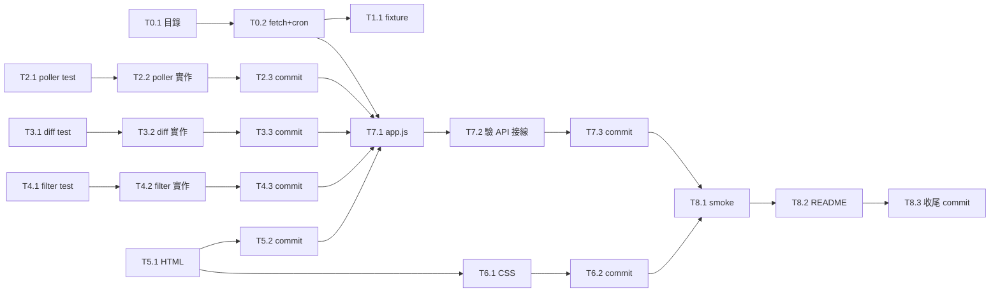

# Kanban Dashboard 開發任務清單

> **文件定位**：本檔是**開發任務規劃文件**（要做什麼、為何做、依賴關係、優先順序），不包含任何實作程式碼。
>
> 實作細節落在對應的原始檔：
> - `architecture.md` — 系統架構、部署模式、資料流、API 規格
> - `research-plan.md` — 研究紀錄、評估過的替代方案、決策依據
> - 應用程式碼（`index.html` / `styles.css` / `app.js` / `app/poller.js` / `app/diff.js` / `app/filter.js` / `fetch_data.sh`）— 各自獨立檔案
> - 測試案例（`tests/*.test.mjs`）— 各自獨立檔案
>
> **對 Hermes 的執行指引**：用 subagent-driven-development skill 逐項執行；每個任務 = 2-5 分鐘聚焦工作，程式碼直接寫到對應檔案、不再嵌入本檔。

---

## 前置決策（已敲定，無需重做）

| 決策 | 結論 | 理由摘要 |
|---|---|---|
| **D1 部署模式** | 模式 B：`python3 -m http.server` + `fetch_data.sh` 由 cron 每 5 秒寫 `snapshot.json` | 瀏覽器 `file://` 會擋 `fetch()`；前端不直接呼叫 CLI（多 tab 重複 spawn 開銷高）→ 由 cron 集中跑、前端只讀靜態檔。詳見 `architecture.md` §7 |
| **D2 互動版 Mermaid** | 不做 | `architecture.md` 內的 Mermaid 圖只作為文件附件，不在前端渲染 |
| **D3 套件管理** | 零依賴（zero-dep），不用 npm/package.json | 純靜態單頁應用；測試用 Node 內建 `node --test` 即可，無需引入 `npm install` |
| **D4 測試範圍** | 純函式邏輯（poller / diff / filter）走 `node --test`；UI 行為走手動 smoke test | 純函式便宜好測；DOM 行為在 JSDOM 模擬成本高、ROI 低，留給 Task 8 手動驗 |

---

## 階段劃分 (Phase Breakdown)

| Phase | 名稱 | 任務範圍 | 產出 |
|---|---|---|---|
| **P0** | 環境與資料鏈 | Task 0.1 – 0.2 | 專案目錄 + cron 跑起 `snapshot.json` 與 `tasks/<id>.json` |
| **P1** | 核心邏輯層 | Task 1.1, 2.1 – 2.3, 3.1 – 3.3, 4.1 – 4.3 | Poller、Diff、Filter 三個純函式模組 + 對應測試 + 固定 fixture |
| **P2** | 介面層 | Task 5.1 – 5.2, 6.1 – 6.2 | `index.html` 骨架 + `styles.css` 暗色主題與動畫 |
| **P3** | 整合層 | Task 7.1 – 7.3 | `app.js` 把 poller/diff/filter 接到 DOM renderer（卡片、profile strip、modal、degraded mode） |
| **P4** | 驗收 | Task 8.1 – 8.3 | README + 手動 smoke test + 完整驗收清單 |

---

## 開發任務清單 (Task Inventory)

### Phase 0 — 環境與資料鏈

#### Task 0.1 — 建立專案目錄
- **要做什麼**：在 `/tmp/kanban-dashboard/` 建立 `index.html`、`styles.css`、`app.js`、`fetch_data.sh`、`sample-snapshot.json` 與 `tests/` 子目錄；不建立 `package.json`。
- **產出檔案**：目錄結構 + 空殼檔案（之後任務填實）。
- **驗收**：`ls /tmp/kanban-dashboard/` 看到前述檔案 + `tests/` 目錄存在；`fetch_data.sh` 為可執行（`-rwxr-xr-x`）。

#### Task 0.2 — 設定 `fetch_data.sh` + cron 排程
- **要做什麼**：寫 `fetch_data.sh`（呼叫 `hermes kanban list/show --json` 寫出 `snapshot.json` 與 `tasks/<id>.json`），註冊 cron 每 5 秒跑一次（vixie-cron fallback：`_loop.sh` 無窮迴圈 + nohup）。
- **產出檔案**：`fetch_data.sh`（腳本內容見 `architecture.md` §8.1）；執行期產出 `snapshot.json`、`tasks/<id>.json`。
- **驗收**：手動跑一次印出 valid JSON；10 秒後 `snapshot.json` 與 `tasks/<id>.json` 的 mtime 有更新。

### Phase 1 — 核心邏輯層

#### Task 1.1 — 寫 `sample-snapshot.json` 固定 fixture
- **要做什麼**：從真實 CLI 抓 `hermes kanban list --json` + `hermes kanban assignees --json`，合併後寫入 repo 內的固定 fixture，給「沒裝 hermes / 純前端開發 / 視覺回歸」用。
- **產出檔案**：`sample-snapshot.json`（結構等同 fetch_data.sh 輸出）；輔助腳本 `scripts/build-sample.mjs`（可選、之後重建時用）。
- **驗收**：`python3 -c "import json; json.load(open(...))"` 不報錯；shape 對齊 `architecture.md` §3 定義。

#### Task 2.x — Poller 模組（TDD：先紅燈再綠燈）
- **2.1** 寫失敗測試 → 產出 `tests/poller.test.mjs`（驗證：啟動立即觸發一次、停止後不再呼叫、pause/resume/trigger/setInterval 行為）。
- **2.2** 實作 → 產出 `app/poller.js`，匯出 `createPoller({ fetcher, interval, onError })`，提供 `start / stop / pause / resume / trigger / setInterval / on` API，避免 in-flight 重疊。
- **2.3** Commit。
- **驗收**：`node --test tests/poller.test.mjs` 全綠。

#### Task 3.x — Store 與 Diff Engine（TDD）
- **3.1** 寫失敗測試 → 產出 `tests/diff.test.mjs`（驗證：added / removed / changed 三種事件、無變化時回空陣列）。
- **3.2** 實作 → 產出 `app/diff.js`，匯出 `diff(prev, next)`，比對兩個 `{ tasks: Map }` 快照，輸出事件流（含 status 與 assignee 變化明細）。
- **3.3** Commit。
- **驗收**：`node --test tests/diff.test.mjs` 全綠。

#### Task 4.x — Filter & Sort（TDD）
- **4.1** 寫失敗測試 → 產出 `tests/filter.test.mjs`（驗證：status 篩選、assignee 篩選、排序 created_desc/asc/title_asc、組合篩選+排序）。
- **4.2** 實作 → 產出 `app/filter.js`，匯出 `applyFilter(tasks, { status, assignee, sort })`，對未知 status 防呆（忽略）。
- **4.3** Commit。
- **驗收**：`node --test tests/filter.test.mjs` 全綠。

### Phase 2 — 介面層

#### Task 5.x — HTML 骨架
- **5.1** 寫 `index.html`（結構：header 含 Pause/Refresh 控制鈕、meta 含三個 filter `<select>`、profiles strip、tasks grid、footer、modal `<dialog>`、ESM 載入 `app.js`）。
- **5.2** Commit。
- **驗收**：瀏覽器開啟時渲染完整骨架；無 console error。

#### Task 6.x — CSS 暗色主題與動畫
- **6.1** 寫 `styles.css`（：root CSS 變數定義色票/動畫時長；reduced-motion 媒體查詢降為 0.01ms；卡片 enter/exit、badge pulse、profile just-up、shimmer skeleton 等 keyframes；600px 以下單欄 layout）。
- **6.2** Commit。
- **驗收**：瀏覽器視覺檢查符合 `architecture.md` §5 mockup；reduced-motion 環境下動畫 ≤ 1ms。

### Phase 3 — 整合層

#### Task 7.x — `app.js` 整合
- **7.1** 寫主入口 → 產出 `app.js`：建立 `store`（tasks/profiles/meta）、掛接 Poller → 收到 snapshot 跑 Diff → 套用進 Store → 觸發 DOM 更新（mountCard / removeCard / updateCard / pulseBadge），處理 status 變化 200ms pulse cooldown、degraded mode（連續 3 次失敗 → 30s interval）、profile offline→online just-up 動畫、modal 開啟時 fetch `tasks/<id>.json` 顯示最後 heartbeat、Escape/鍵盤快捷鍵 (p/r)。
- **7.2** 手動驗證 Poller `trigger()` / `setInterval()` API 接線（btnRefresh 立即重抓；degraded 切換）。
- **7.3** Commit。
- **驗收**：瀏覽器實際操作符合驗收清單（見下）；poller 既有測試仍全綠。

### Phase 4 — 驗收

#### Task 8.x — Smoke test 與文件
- **8.1** 啟動 `python3 -m http.server 8000` 並手動 smoke test。
- **8.2** 寫 `README.md`（啟動指令、鍵盤快捷鍵、模式 B 運作說明、sample-snapshot.json vs snapshot.json 差別）。
- **8.3** 收尾 commit。
- **驗收**：完整驗收清單（見下）每一項可勾選。

---

## 開發流程 (Development Flow)

```
T0.1 目錄骨架
   │
   ▼
T0.2 fetch_data.sh + cron ─── 必須先跑起來，否則前端除錯會懷疑錯方向
   │
   ├─► T1.1 sample-snapshot.json fixture（離線開發用）
   │
   ▼
P1 純邏輯 TDD 循環（每個模組）：
   T_x.1 寫紅燈測試 → T_x.2 實作 → T_x.3 commit
   │  Poller ─► Diff ─► Filter
   ▼
P2 介面層（先 HTML 結構、再 CSS 樣式與動畫）
   ▼
P3 整合層（app.js 把三者接到 DOM）
   ▼
P4 smoke test + README + 驗收
```

每個 Phase 完成後做一次手動檢查（Phase 0 看 snapshot.json 更新、Phase 1 看測試全綠、Phase 2 看瀏覽器渲染、Phase 3 看動畫、Phase 4 跑驗收清單），不要直接從 P0 跳到 P3。

---

## 進度摘要 (Progress Summary)

| 階段 | 狀態 | 完成日期 | 備註 |
|---|---|---|---|
| P0 — 環境與資料鏈 | ✅ 完成 | 2026-06-15 | cron 5 秒輪詢已驗證 mtime 更新 |
| P1 — 核心邏輯層 | ✅ 完成 | 2026-06-15 | Poller / Diff / Filter 三模組 + 測試全綠 |
| P2 — 介面層 | ✅ 完成 | 2026-06-15 | HTML 骨架 + 暗色 CSS + 動畫 |
| P3 — 整合層 | ✅ 完成 | 2026-06-15 | app.js 整合 poller + diff + filter + DOM renderer |
| P4 — 驗收 | ✅ 完成 | 2026-06-15 | 12 項驗收清單全數通過 |

---

## 優先級矩陣 (Priority Matrix)

依「對使用者價值的可見度」與「對其他任務的依賴度」兩軸排序：

| 任務 | 可見度 | 依賴度 | 優先級 | 理由 |
|---|---|---|---|---|
| T0.2 fetch_data.sh + cron | 高 | 高（前端所有任務的前置） | **P0** | 沒資料就沒 dashboard；先驗證熱路徑可跑 |
| T2.x Poller | 低 | 高（被 T7.x 依賴） | **P0** | 所有 UI 資料流的中樞 |
| T3.x Diff | 低 | 中（被 T7.x 依賴） | **P1** | 沒 diff 也能做輪詢渲染，但失去狀態變化追蹤 |
| T4.x Filter | 中 | 中（被 T7.x 依賴） | **P1** | 多 task 時立即需要 |
| T5.x HTML | 高 | 中 | **P1** | 視覺骨架；不寫 JS 也先放好讓瀏覽器看得到 |
| T6.x CSS | 高 | 低 | **P2** | 純視覺，可延後；瀏覽器原生 style 也能先撐住 |
| T7.x app.js 整合 | 高 | 高（收尾） | **P2** | 必須等 poller/diff/filter 與 HTML 都到位 |
| T1.1 sample-snapshot.json | 中 | 低（純開發輔助） | **P2** | 沒 hermes 也能開發，但 P0 跑起來後已可有真資料 |
| T8.x Smoke + README | 高 | 低 | **P3** | 最後收尾；其他都做完才有意義 |

實作順序（綜合優先級與依賴）：**T0.1 → T0.2 → T2.x → T3.x → T4.x → T5.x → T6.x → T1.1 → T7.x → T8.x**

---

## 相依關係 (Dependencies)



**關鍵路徑**：`T0.2 → T2.x → T3.x → T4.x → T5.x → T7.x → T8.x`（任何一個卡住都會擋後續）

**可平行化**：
- `T1.1 fixture` 可在 P1 任務進行時同步寫（不擋主線）
- `T6.x CSS` 可在 `T5.x HTML` 完成後與 `T1.x` 平行
- `T6.2` 之後可與 `T7.x` 動工前段平行（CSS 細節微調不擋 JS 邏輯）

---

## 驗收清單 (Acceptance Checklist)

> 對應原檔 12 項驗收，本檔不再重列每條細項，僅列出分組與指標。

| 群組 | 驗收項數 | 通過標準 |
|---|---|---|
| 自動化測試 | 1 | `node --test tests/*.test.mjs` 全綠（零依賴，不需 npm） |
| 啟動與資料流 | 2 | server 跑得起無 console error；10 秒後 snapshot.json + tasks/<id>.json mtime 更新 |
| 初次載入與輪詢 | 2 | 3 個 profile card + N 個 task card 帶入場動畫；10 秒輪詢無閃爍 |
| 狀態變化與動畫 | 2 | 改 status 後看到 pulse 動畫（200ms cooldown 內只播一次） |
| 控制鈕與鍵盤 | 3 | `p` 切 paused/resumed；`r` 立即重抓；點 task card 開 modal（含 Last heartbeat） |
| 失敗處理 | 1 | snapshot.json 404 後 15 秒出現 degraded mode (30s)，恢復後退回 5s |
| 無障礙與響應式 | 2 | `prefers-reduced-motion: reduce` 下動畫 ≤ 1ms；<600px 單欄不破版 |
| 多 profile 狀態 | 1 | 刪除某 worker pid 檔 → 該 profile 紅燈 offline，無 console error |

---

## 後續可做（不在本期 v1.2.0）

- WebSocket 模式（D3）：當 hermes-gateway 內建 HTTP endpoint 時，fetcher 換實作
- 拖曳 Kanban 視圖（F16）
- 暗 / 亮主題切換（F14）
- modal 多顯示 `branch_name` / `workflow_template_id` / `current_step_key` 欄位
- 把 v1.1.0 tasks.md 內嵌的程式碼片段完全沉澱到對應檔案後，本檔未來不再容納超過 5 行的程式碼區塊
